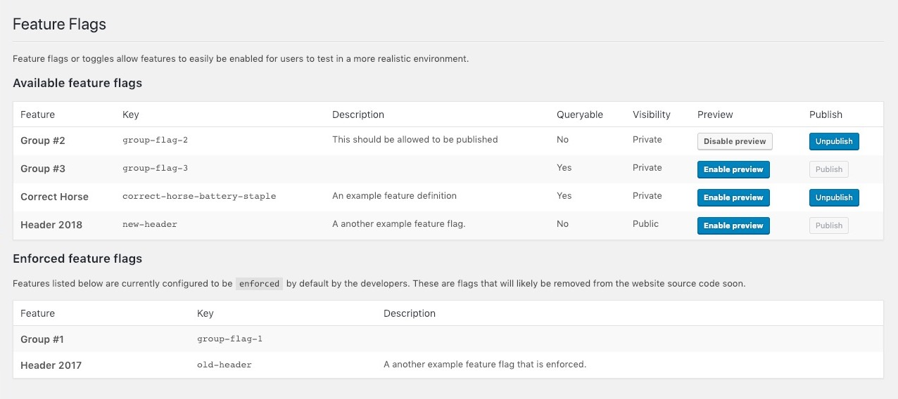

# Feature Flags for WordPress themes



[](https://travis-ci.org/jamesrwilliams/wp-feature-flags) [](https://codeclimate.com/github/jamesrwilliams/wp-feature-flags/maintainability) 

This plugin is for developers. The aim is to simplify/speed up the process of working with feature flags. 
It adds an admin interface where users can enable and disable features for testing, and also be enabled 
using query strings. For planned development work and features see [issues labeled with "enhancement"](https://github.com/jamesrwilliams/feature-flags/issues?q=is%3Aopen+is%3Aissue+label%3Aenhancement).

## Contents

1. [Installation](#installation)
2. [Enabling flags](#enabling-your-flags)
3. [Using flags in your theme](#checking-the-status-of-a-feature-flag)
4. [Shortcode](#the-shortcode)
5. [Contributing](#contributing)

## Installation 

### Required theme changes

Due to the nature of this plugin requiring theme changes, it is a good idea to add the following to the your theme to catch any errors that may occur if the feature-flags plugin is disabled for any reason.

```php
if ( ! function_exists( 'is_enabled' ) ) {
	function is_enabled() {
		return false;
	}
}
```

### Register a flag

```php
register_feature_flag( $args );
```
When registering a flag it is a good idea to wrap them in a function exists block to avoid any errors if the plugin is disabled for any reason. In your templates you can then check the feature status using:

```php
if ( function_exists( 'register_feature_flag' ) ) {

    register_feature_flag([
        
        'title'       => 'My awesome new feature',
        'key'         => 'correct-horse-battery-staple',
        'enforced'    => false,
        'description' => 'An example feature definition'
        'stable'      => false,
    
    ]);
}
```

Alternatively features can be declared as an nested array to avoid large blocks of feature calls:

```php
register_feature_flag([
    [       
        'title'       => 'Listed Feature #1',
        'key'         => 'listed-feature-1',
    ],
    [       
        'title'       => 'Listed Feature #2',
        'key'         => 'listed-feature-2',
    ] 
]);
```

### Feature arguments

| Parameter              | Type      | Default | Description |
|------------------------|-----------|---------|---|
| key                    | `string`  | N/A     |  The unique key used in the template to check if a feature is enabled. |
| title                  | `string`  | ""      | The human readable feature name. |
| enforced (optional)    | `boolean` | `false` | Setting this to true will override any user specific settings and will enforce the flag to be true for every user. Useful for deploying a flag before removing it from the codebase. |
| description (optional) | `string`  | ""      | A description displayed in the admin screen. Use to tell users what they are enabling and other information. |
| stable (optional)      | `boolean` | `false` | Allows users to publish features from the admin area. Has to be enabled. Features default to "unstable". |


## Enabling your flags

There are four ways to have a flag enabled with WP-Feature-Flags. These are as follows:

- **[Previewed](#previewing-a-flag)** - Enable a flag only for the current logged in user.
- **[Published](#publishing-a-flag)** - Enable a flag for every visitor on the site.
- **[Enforced](#enforcing-a-flag)** - Flags which are enabled by default by developers.

### Previewing a flag

Any flag can be previewed. This can be done via the Feature Flags admin screen and pressing the "Enabled Preview" button. This will enable a flag for the current logged in user, which is great for previewing a feature while limiting it's exposure to users. This can then be turned off again by pressing the "disable preview" button. Users can preview any number of flags at any one time.

### Publishing a flag

Publishing a flag enables it for every user that visits your site, this includes logged out users. Currently any user can publish a feature as long as it has been marked as stable in the flag options like so: `['stable' => true]`. This acts as a safety net letting developers mark features ready for publication.

### Enforcing a flag

Enforcing a flag is where a developer can force a flag to be published. This allows them to toggle a flag via their source code by setting the 'enforced' option to true in the flag options. These are displayed in a separate list in the admin area and are not interactive to users in the admin area.

## Checking the status of a feature flag

Use the `is_enabled()` function in your PHP theme code to toggle features based on the status of your flags:

```php
is_enabled( 'feature-key' );
```
Replace `feature-key` with the key used in the register function to check if it is enabled.

**Example** - If my feature key was `foo`:

```php
if ( is_enabled( 'foo' ) ) {
    /* Flagged feature */
}
```

## The Shortcode

This plugin adds a utility shortcode to help to debug the use of feature flags. 

```php
echo do_shortcode('[debugFeatureFlags]');
```

The shortcode by default shows all feature flags that are not enforced found in your theme. You can also specify which flags you're looking to debug specifically using the flag parameter like so with either a single key or a comma separated list:

```php
// Single Key
echo do_shortcode('[debugFeatureFlags flag="key-1"]');

// Mutliple keys
echo do_shortcode('[debugFeatureFlags flag="key-1,key-2,key-3"]');
```

## Contributing

Any PRs and suggestions are very welcome, along with ideas and discussions on issues. 
This project uses the [WordPress VIP](https://github.com/Automattic/VIP-Coding-Standards) coding standards.
